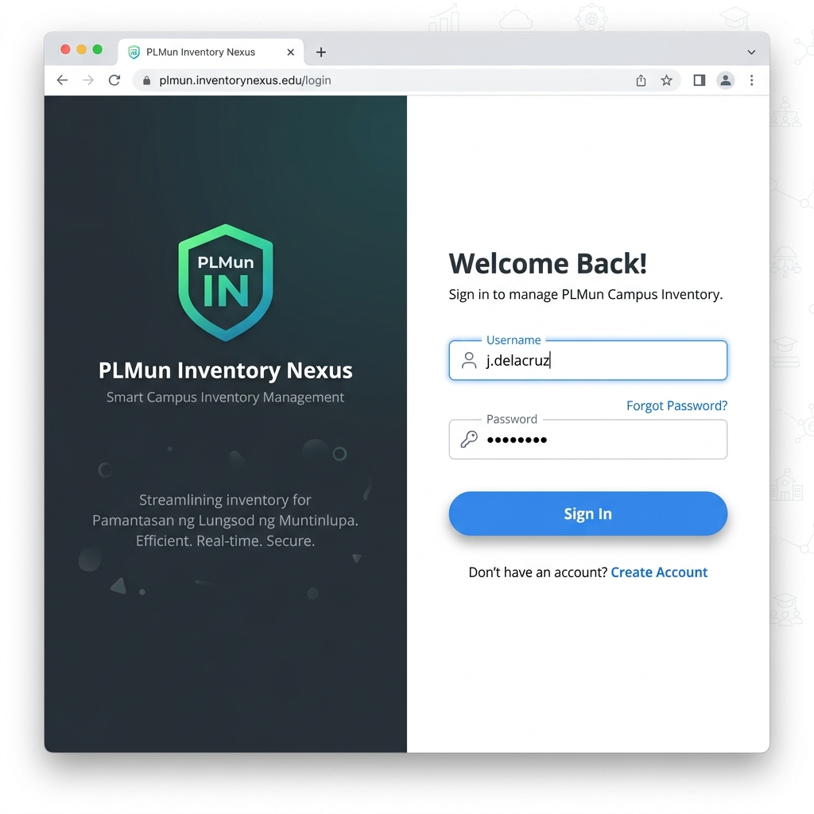
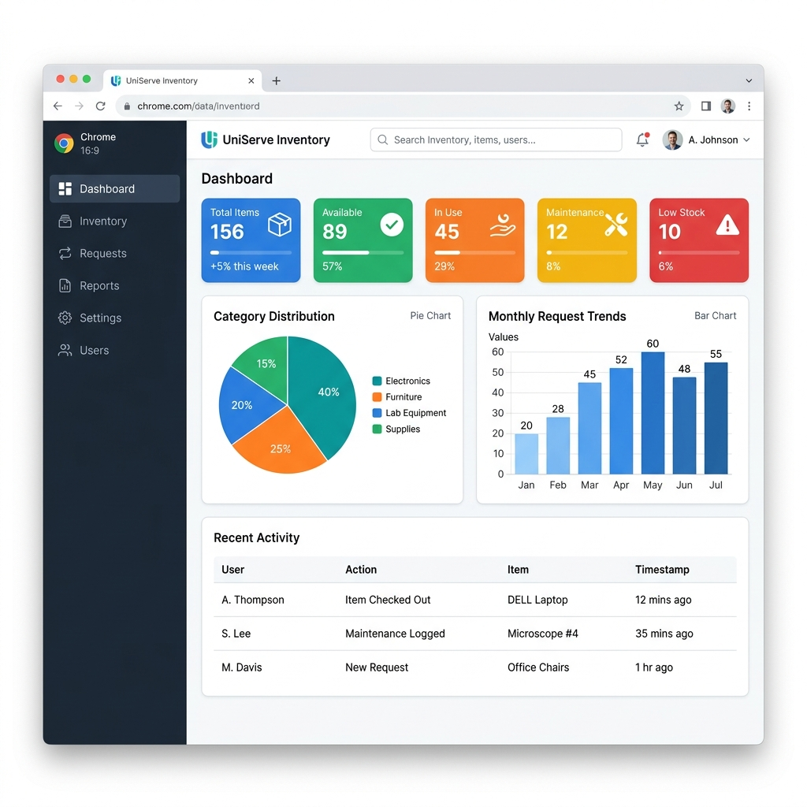
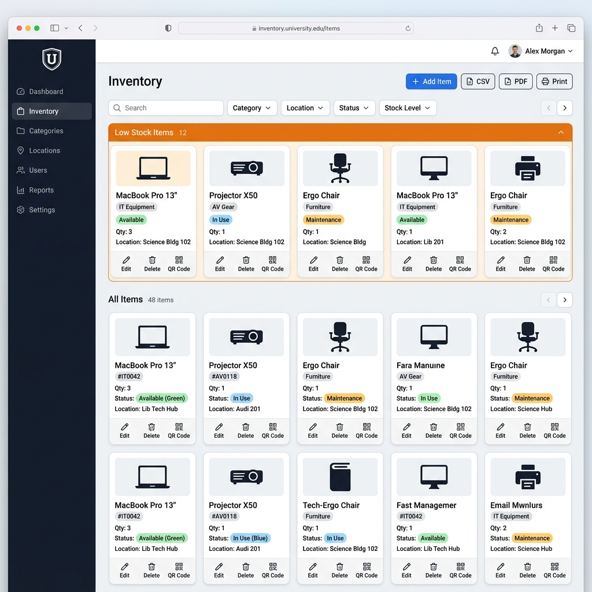
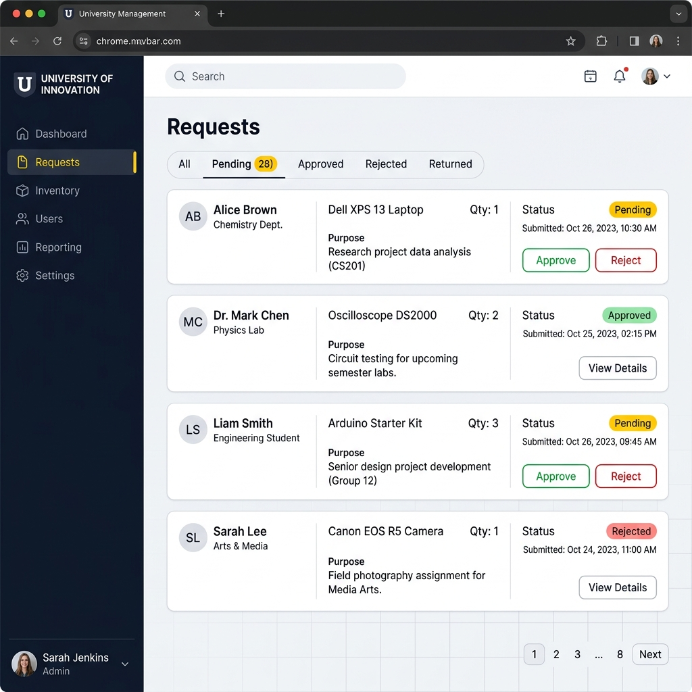
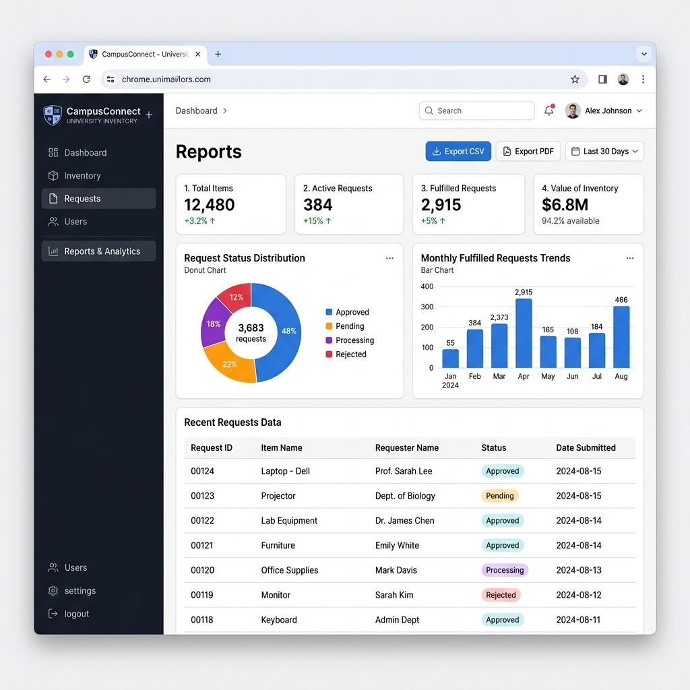

# System Planning & Design Documentation

## PLMun Inventory Nexus
### BSCS 3D · Software Engineering 1 · AY 2025–2026

---

## 1. Project Overview

### 1.1 Problem Statement

The Pamantasan ng Lungsod ng Muntinlupa (PLMun) currently handles inventory management through manual paper-based logs and spreadsheets. This approach leads to:

- **Data inconsistency** — duplicate entries and conflicting records across departments
- **Slow request processing** — borrow requests require physical forms and manual approval chains
- **No real-time visibility** — staff cannot quickly determine item availability or location
- **No accountability trail** — difficult to track who borrowed what and when it was returned
- **No overdue tracking** — borrowed items are frequently returned late with no automated follow-up

### 1.2 Proposed Solution

**PLMun Inventory Nexus** — a full-stack web-based inventory management system that digitizes the entire borrow-and-return lifecycle. The system provides:

- **Role-based access** for Students, Faculty, Staff, and Admin
- **Real-time inventory tracking** with category, status, and stock-level management
- **Digital borrow request workflow** with approval, release, return, and overdue detection
- **Dashboard analytics** with charts and exportable reports (CSV/PDF)
- **Audit logging** for full accountability and administrative oversight

### 1.3 Objectives

1. **Digitize inventory records** — Replace paper logs with a searchable, filterable, centralized database
2. **Automate the borrow workflow** — Replace physical request forms with a digital pipeline (Pending → Approved → Released → Returned)
3. **Enforce role-based access** — Ensure only authorized Staff/Admin can modify inventory; Students and Faculty can only view and request
4. **Provide real-time analytics** — Dashboard with live stats, charts, and low-stock alerts to support data-driven decisions
5. **Ensure accountability** — Every action (login, edit, approve, delete) is recorded in a tamper-proof audit log with timestamps and IP addresses
6. **Support export & reporting** — Generate CSV and PDF files for physical filing and external audits

### 1.4 Project Scope

| In Scope | Out of Scope |
|----------|-------------|
| User registration and authentication | Barcode/RFID scanner hardware integration |
| Inventory CRUD with image uploads | Mobile native app (iOS/Android) |
| Borrow request lifecycle management | Email/SMS notifications |
| Role-based permissions (4 roles) | Multi-campus/multi-organization support |
| Dashboard with charts and statistics | Procurement/purchasing module |
| CSV/PDF report generation | Financial tracking or budgeting |
| QR code generation per item | Integration with existing PLMun systems |
| Dark mode and responsive design | Offline mode |

---

## 2. How the System Works — Complete User Flows

This section describes every user journey through the system, step by step, from login to logout.

### 2.1 Registration & Login Flow

**New User Registration:**
1. User navigates to the Register page
2. Fills in: First Name, Last Name, Username, Email, Student ID, Department, Password, Confirm Password
3. Client validates: all fields required, password minimum 8 characters, passwords match, username/email uniqueness
4. On submit, the frontend sends `POST /api/auth/register/` with the form data
5. Backend creates the user with **role = STUDENT** (default), hashes the password using bcrypt, stores in database
6. Backend returns JWT tokens (access + refresh) — user is automatically logged in
7. An AuditLog entry is created: action="Register", with IP address
8. User is redirected to the Dashboard (or Requests page for students)

**Returning User Login:**
1. User enters Username and Password on the Login page
2. Client sends `POST /api/auth/login/`
3. Backend checks: Does this username exist? Is the account active? Is it locked out?
4. If locked out (≥5 failed attempts in the last 15 minutes), return error with remaining lockout time
5. If password is correct: reset failed attempts counter, create AuditLog entry (action="Login"), return JWT tokens with embedded user profile
6. If password is wrong: increment failed attempts counter, create AuditLog entry (action="Login Failed"), return error
7. Frontend stores tokens in localStorage via Zustand persist middleware
8. User is redirected to their default page based on role:
   - Student → Requests page
   - Faculty → Dashboard
   - Staff → Dashboard
   - Admin → Dashboard

**Token Refresh (Silent):**
1. User is browsing the system — access token expires after 60 minutes
2. The next API call returns 401 Unauthorized
3. Axios interceptor catches the 401, sends `POST /api/auth/token/refresh/` with the refresh token
4. If refresh token is valid (within 7 days): new access token returned, original request retried automatically
5. If refresh token is also expired: user is logged out and redirected to login page
6. If multiple API calls fail simultaneously (e.g., dashboard loading stats + notifications at once), a mutex queue ensures only ONE refresh request is sent — the other calls wait and retry with the new token

### 2.2 How the Dashboard Works

The Dashboard is the central hub for Faculty, Staff, and Admin users. Here is what happens when a user opens the Dashboard:

1. **Data Loading:** Two hooks fire simultaneously:
   - `useInventory()` → `GET /api/inventory/` — fetches all inventory items
   - `useRequests()` → `GET /api/requests/` — fetches all requests
2. **Statistics Computation (Client-Side):**
   - Total Items: count of all items
   - Available: count where status = "AVAILABLE"
   - In Use: count where status = "IN_USE"
   - Maintenance: count where status = "MAINTENANCE"
   - Low Stock: count where quantity > 0 AND quantity ≤ 5
3. **Charts Rendered:**
   - **Category Pie Chart:** Groups items by category (Electronics, Furniture, Equipment, Supplies, Other) and renders a Recharts PieChart
   - **Monthly Trends Bar Chart:** Groups requests by month using `date-fns` and renders a Recharts BarChart showing request volume over time
   - **Status Breakdown:** Visual breakdown of request statuses (Pending, Approved, Rejected, etc.)
4. **Recent Activity Feed:** Filters requests to show only TODAY's requests, sorted by newest first. This gives staff a daily snapshot of what's happening.
5. **Low Stock Alerts:** Items with quantity ≤ 5 appear as yellow warning cards. Clicking one navigates to `/inventory?item={id}`, which auto-opens the item detail modal on the Inventory page.
6. **Quick Actions:** Shortcut buttons for "Add Item" and "New Request" for fast access.

### 2.3 How Inventory Management Works

**Browsing Items (All Users):**
1. User navigates to the Inventory page
2. Frontend sends `GET /api/inventory/` with the user's JWT token
3. Backend filters items by `access_level` — Students only see items marked "STUDENT" access, while Staff/Admin see all items
4. Frontend receives the item array and computes stock groups:
   - 🔴 Out of Stock (quantity = 0)
   - 🟡 Low Stock (quantity 1–5)
   - 🟢 Normal Stock (quantity > 5)
5. Items are displayed in either Card Grid or Data Table view (user preference saved in UI store)
6. User can filter by: text search (name), category dropdown, status dropdown
7. Pagination is applied client-side: 6, 12, 24, or 48 items per page (configurable in Settings)

**Adding a New Item (Staff/Admin Only):**
1. Staff clicks "Add Item" → modal opens with the form
2. Staff fills in: Name, Category, Quantity, Status, Location, Description, Image (optional), Access Level, Priority, Is Returnable, Borrow Duration
3. Default values (category, status, location) can be pre-configured in Settings → Inventory tab to speed up bulk entry
4. On submit: frontend creates a `FormData` object (to support image upload), sends `POST /api/inventory/`
5. Backend validates the data, saves the item, stores the image in `/media/items/`
6. Backend creates an AuditLog: action="Item Created", details="Created item Laptop (category: ELECTRONICS, qty: 15)"
7. Frontend optimistically adds the new item to the local inventory array without re-fetching the entire list
8. Stats are recomputed instantly

**Editing an Item (Staff/Admin Only):**
1. Staff clicks the Edit (pencil) icon on an item card or table row
2. The Add/Edit modal opens with all fields pre-filled with current values
3. Staff modifies the desired fields
4. On submit: `PUT /api/inventory/{id}/` or `PATCH /api/inventory/{id}/` (partial update)
5. Backend updates the record, creates AuditLog: action="Item Updated"
6. Frontend updates the item in the local array

**Deleting an Item (Staff/Admin Only):**
1. Staff clicks the Delete (trash) icon → confirmation modal appears: "Are you sure? This action cannot be undone."
2. On confirm: `DELETE /api/inventory/{id}/`
3. Backend deletes the item record. Note: existing requests that reference this item still have the item name preserved via the denormalized `item_name` field
4. AuditLog: action="Item Deleted", details="Deleted item Laptop (id: 42)"
5. Frontend removes the item from the local array

**Changing Item Status (Staff/Admin Only):**
1. Staff clicks one of the status action buttons on the card:
   - 🔧 "Send to Maintenance" (AVAILABLE → MAINTENANCE)
   - ✅ "Mark Available" (MAINTENANCE → AVAILABLE or RETIRED → AVAILABLE)
   - ⚫ "Retire" (AVAILABLE → RETIRED)
2. A note field appears — staff must explain why (e.g., "Screen cracked, sent for repair")
3. For MAINTENANCE: an optional Maintenance ETA date picker appears
4. On submit: `POST /api/inventory/{id}/change_status/` with `{ status, note, maintenance_eta }`
5. Backend updates the item, logs the status change in AuditLog

**Generating QR Code:**
1. Staff clicks the QR icon on any item
2. A modal opens showing a QR code generated client-side by the `qrcode.react` library
3. The QR code encodes a URL that points to the item detail (e.g., `https://plmun-nexus.com/inventory?item=42`)
4. Staff can print the QR code to attach physically to the item

### 2.4 How the Borrow Request Workflow Works

This is the most complex process in the system. Here is the complete lifecycle of a single borrow request:

**Step 1: Student Submits Request**
1. Student browses the Inventory page, finds an available item (green badge, quantity > 0)
2. Clicks the "Request" button on the item card
3. A form appears: Quantity (cannot exceed available stock), Purpose (required text), Expected Return Date (if item is returnable)
4. On submit: `POST /api/requests/` with `{ item_id, quantity, purpose, expected_return }`
5. Backend creates a new Request record with:
   - `status = "PENDING"` — waiting for staff review
   - `item_name = item.name` — snapshot of the item name at this moment
   - `requested_by = current_user`
6. Backend creates a notification for ALL Staff users: "New borrow request from Juan Dela Cruz for Laptop"
7. AuditLog: action="Request Created"
8. Student's request appears in their Requests page with a yellow PENDING badge

**Step 2: Staff Reviews the Request**
1. Staff opens the Requests page → sees all pending requests from all users
2. Each request card shows: Requester name, Item name, Quantity requested, Purpose, Date submitted
3. Staff can add a Comment to ask for more details (e.g., "What class do you need this for?")
4. Comments trigger notifications to the requester
5. Staff decides to Approve or Reject

**Step 3A: Staff Approves the Request**
1. Staff clicks "Approve" button
2. Frontend sends `POST /api/requests/{id}/approve/`
3. **Critical: Atomic Stock Deduction** — Backend uses Django's `F()` expression:
   ```
   rows = Item.objects.filter(id=item_id, quantity__gte=requested_qty)
                      .update(quantity=F('quantity') - requested_qty)
   ```
   This runs as a single SQL UPDATE with a WHERE clause. If two staff members try to approve the same request simultaneously, or if two requests for the same item are approved at the same time:
   - The first UPDATE succeeds (rows = 1)
   - The second UPDATE finds quantity < requested_qty, so it affects 0 rows (rows = 0)
   - The second approval is rejected with "Insufficient stock"
4. Request status changes to "APPROVED", `approved_by` and `approved_at` are set
5. Notification sent to requester: "Your request for Laptop has been approved"
6. AuditLog: action="Request Approved"

**Step 3B: Staff Rejects the Request**
1. Staff clicks "Reject" → a text field appears for the rejection reason (required)
2. Staff enters reason (e.g., "This item is reserved for another department")
3. `POST /api/requests/{id}/reject/` with `{ reason }`
4. Request status changes to "REJECTED", rejection_reason saved
5. No stock change — quantity was never deducted for pending requests
6. Notification sent to requester: "Your request for Laptop was rejected: [reason]"

**Step 4: Staff Releases the Item**
1. After approval, the item needs to be physically handed to the requester
2. Staff clicks "Release" when the student picks up the item
3. `POST /api/requests/{id}/release/`
4. Request status changes to "COMPLETED" — item is now physically with the requester
5. Notification: "Your Laptop is ready for pickup"

**Step 5: Staff Processes the Return**
1. When the student returns the item, staff clicks "Return Item"
2. `POST /api/requests/{id}/return_item/`
3. **Stock Restoration:** `Item.objects.filter(id=item_id).update(quantity=F('quantity') + qty)`
4. Request status changes to "RETURNED", `returned_at` timestamp set
5. **Overdue Detection:** If `returned_at > expected_return`:
   - User's `is_flagged` is set to `True`
   - User's `overdue_count` is incremented (lifetime counter, never reset)
   - The overdue duration is calculated and logged (e.g., "Overdue by 3 days")
6. Notification: "Your Laptop has been returned successfully"

**Step 6: Student Cancels (Optional)**
- While a request is still PENDING, the student can cancel it
- Only the original requester can cancel, and only if status is PENDING
- No stock impact (stock wasn't deducted yet)

### 2.5 How the Notification System Works

1. **Trigger Events:** Notifications are created automatically when:
   - A new request is submitted (→ all Staff notified)
   - A request is approved/rejected/released/returned (→ Requester notified)
   - A comment is added to a request (→ the other party notified)
   - An overdue return is detected (→ Requester notified)

2. **Deduplication (Anti-Spam):**
   - Rule 1: If an unread notification of the same type + request exists → skip (user hasn't seen the first one yet)
   - Rule 2: If a read notification of the same type + request exists within 24 hours → skip (cooldown period)
   - This prevents notification spam when status changes happen rapidly

3. **Delivery via Polling:**
   - Frontend uses `useNotifications()` hook which polls `GET /api/requests/notifications/` every 30 seconds
   - Unread count appears as a red badge on the bell icon in the header
   - Clicking the bell opens a dropdown list of notifications sorted by newest first

4. **Mark as Read:**
   - Single: `POST /api/requests/notifications/{id}/mark_read/`
   - All: `POST /api/requests/notifications/mark_all_read/`

### 2.6 How Reports & Export Works

1. Staff/Admin navigates to the Reports page
2. Data is fetched from both Inventory and Requests endpoints
3. Statistics are computed: total items, request trends, category distribution, status breakdown
4. Charts are rendered: pie chart (categories), bar chart (monthly trends), donut chart (request statuses)
5. A data table shows all requests with filtering and sorting
6. **Export to CSV:**
   - Headers and rows are compiled into a UTF-8 CSV string with BOM (`\uFEFF`) for Excel compatibility
   - Browser's File System Access API (`showSaveFilePicker`) opens a native "Save As" dialog
   - User chooses filename and location → file is written directly
   - Fallback for Firefox/Safari: anchor-based download
7. **Export to PDF:**
   - jsPDF creates an A4 landscape document client-side (no server involved)
   - Title, timestamp, and summary stats are added at the top
   - jspdf-autotable renders the data as a formatted table with alternating row colors and page numbers
   - Same "Save As" dialog as CSV
8. **Print:**
   - A clean print-optimized HTML page is generated and opened in a new tab
   - `window.print()` triggers the browser's print dialog

### 2.7 How User Administration Works (Admin Only)

1. Admin navigates to the Users page
2. All registered users are listed with: name, email, role badge, department, registration date, request count
3. **Change Role:** Admin selects a new role from a dropdown (Student → Faculty → Staff → Admin). Change takes effect on the user's next API call.
4. **Deactivate:** Admin toggles a user's active status. Deactivated users cannot log in but their data is preserved. Can be reactivated later.
5. **Delete:** Admin can permanently delete a user. A confirmation modal prevents accidental deletion. Admin cannot delete their own account.
6. **Audit Logs:** In Settings → Admin tab, admin can view the complete audit trail: who did what, when, from what IP address. 14 action types are tracked.
7. **System Maintenance:** Staff/Admin can "Clear History" to soft-delete completed/returned/cancelled requests (sets `is_cleared=True`). This cleans the active view while preserving data for reports.

### 2.8 How Settings & Personalization Works

1. **Profile Tab (All Users):** Edit first name, last name, email, phone, department. Upload or change avatar photo. Change password (requires current password verification).
2. **Appearance Tab (All Users):** Choose theme (Light/Dark/System — "System" follows OS preference). Choose default view mode for Inventory (Card or Table). Set items per page (6/12/24/48). Toggle item images on/off.
3. **Inventory Tab (Staff+ Only):** Set default values for new items — default category, default status, default location. These pre-fill the "Add Item" form to speed up repetitive entry.
4. **Admin Tab (Admin Only):** View audit logs with filtering. Link to User Management page. System maintenance (clear request history).

All preferences are saved to localStorage via Zustand persist middleware — they survive page refreshes and browser restarts.

---

## 3. Development Methodology

### 3.1 Agile Scrum Framework

The project follows **Agile Scrum** with 2-week sprints aligned to the academic calendar.

| Sprint | Period | Focus | Deliverables |
|--------|--------|-------|-------------|
| Sprint 0 | Jan 6 – Jan 19 | Requirements, setup, design | Project plan, wireframes, DB schema, dev environment |
| Sprint 1 | Jan 20 – Feb 2 | Authentication & shell | Login, Register, JWT auth, sidebar layout, routing |
| Sprint 2 | Feb 3 – Feb 16 | Inventory features | Item CRUD, card/table views, image upload, filters |
| **Milestone** | **Feb 9** | **1st System Checking** | Demo: auth + basic inventory working |
| Sprint 3 | Feb 17 – Mar 2 | Request workflow | Submit, approve, reject, release, return, notifications |
| Sprint 4 | Mar 3 – Apr 5 | Polish & documentation | Reports, exports, admin panel, bug fixes, docs |
| **Milestone** | **Apr 6** | **2nd System Checking** | Full system demo with all features |
| Final | Late April | Defense prep | Final docs, presentation, defense |

### 3.2 Team Structure & Roles

| Role | Responsibilities |
|------|-----------------|
| Project Manager | Sprint planning, task assignment, timeline management |
| Backend Developer | Django models, API views, serializers, permissions |
| Frontend Developer | React components, pages, state management, UI/UX |
| Full-Stack Developer | Cross-stack features, integration, deployment |
| QA / Documentation | Testing, bug reports, system documentation, user manual |
| Systems Analyst | Requirements analysis, DFD, ERD, data dictionary |

---

## 4. System Architecture

### 4.1 Architecture Decision: Decoupled SPA

```
┌─────────────────────┐        REST API        ┌─────────────────────┐
│   React Frontend    │ ◄──── JSON/JWT ────►   │   Django Backend    │
│   (Vite + Zustand)  │                         │   (DRF + SimpleJWT) │
│   Port: 5173        │                         │   Port: 8000        │
│   Static on Render  │                         │   Gunicorn on Render│
└─────────────────────┘                         └─────────────────────┘
                                                         │
                                                    PostgreSQL 16
                                                    (Render Managed)
```

**How the frontend and backend communicate:**
1. Frontend (React) makes HTTP requests using Axios to the backend's REST API
2. Every request includes a `Bearer {JWT_token}` header for authentication
3. Backend validates the JWT, extracts user identity, checks permissions
4. Backend queries PostgreSQL, processes business logic, returns JSON response
5. Frontend updates the UI with the received data — no full page reload needed

### 4.2 Technology Selection

| Layer | Choice | Why |
|-------|--------|-----|
| **Backend** | Django 6.0 + DRF | Batteries-included ORM, admin panel, built-in auth, excellent docs |
| **Frontend** | React 18 + Vite 5 | Component-based, massive ecosystem, fast HMR dev server |
| **Database** | PostgreSQL 16 | ACID compliant, concurrent-safe, production-grade |
| **Auth** | JWT (SimpleJWT) | Stateless, scalable, 60min access / 7d refresh tokens |
| **State** | Zustand | 2KB, simpler than Redux, built-in localStorage persistence |
| **Styling** | Tailwind CSS 3 | Utility-first, rapid prototyping, consistent design tokens |
| **Charts** | Recharts | Native React SVG charts, responsive, simple API |
| **Hosting** | Render.com | Free tier, auto-deploy from Git, managed PostgreSQL |

### 4.3 Role Hierarchy & Permissions Matrix

```
ADMIN (Level 4) ──── Full system control, user management
  ↑
STAFF (Level 3) ──── Inventory CRUD, request approval, reports
  ↑
FACULTY (Level 2) ── Dashboard, inventory viewing, request submission
  ↑
STUDENT (Level 1) ── Browse available items, submit borrow requests
```

**Detailed Permission Matrix:**

| Feature | Student | Faculty | Staff | Admin |
|---------|---------|---------|-------|-------|
| View available items | ✅ | ✅ | ✅ | ✅ |
| View item details | ✅ | ✅ | ✅ | ✅ |
| Submit borrow request | ✅ | ✅ | ✅ | ✅ |
| Cancel own request | ✅ | ✅ | ✅ | ✅ |
| View own requests | ✅ | ✅ | ✅ | ✅ |
| View Dashboard | ❌ | ✅ | ✅ | ✅ |
| Add new item | ❌ | ❌ | ✅ | ✅ |
| Edit item | ❌ | ❌ | ✅ | ✅ |
| Delete item | ❌ | ❌ | ✅ | ✅ |
| Change item status | ❌ | ❌ | ✅ | ✅ |
| Approve/Reject requests | ❌ | ❌ | ✅ | ✅ |
| Release/Return items | ❌ | ❌ | ✅ | ✅ |
| View all requests | ❌ | ❌ | ✅ | ✅ |
| Export reports (CSV/PDF) | ❌ | ❌ | ✅ | ✅ |
| View audit logs | ❌ | ❌ | ✅ | ✅ |
| Clear request history | ❌ | ❌ | ✅ | ✅ |
| Manage users | ❌ | ❌ | ❌ | ✅ |
| Assign roles | ❌ | ❌ | ❌ | ✅ |
| Deactivate users | ❌ | ❌ | ❌ | ✅ |
| System settings | ❌ | ❌ | ❌ | ✅ |

---

## 5. Database Planning

### 5.1 Entity-Relationship Summary

| Entity | Fields | Relationships |
|--------|--------|---------------|
| **User** | username, email, role, department, student_id, avatar, phone, is_flagged, overdue_count | Has many: Requests, AuditLogs, Notifications, Comments |
| **Item** | name, category, quantity, status, location, image, description, priority, access_level, is_returnable, borrow_duration | Has many: Requests |
| **Request** | item (FK), item_name, requested_by (FK), quantity, purpose, status, approved_by, rejection_reason, expected_return, returned_at, is_cleared | Belongs to: User, Item · Has many: Comments, Notifications |
| **Comment** | request (FK), author (FK), text, created_at | Belongs to: Request, User |
| **Notification** | recipient (FK), sender (FK), request (FK), type, message, is_read | Belongs to: User, Request |
| **AuditLog** | user (FK), username, action, details, ip_address, timestamp | Belongs to: User |

### 5.2 Key Design Decisions

1. **Denormalized `item_name` on Request** — When a student requests "Dell Laptop", we store "Dell Laptop" as a string on the request. Even if the item is later renamed to "Dell Latitude 5540" or deleted entirely, the request history still shows the original name.

2. **Soft delete for Requests** — `is_cleared=True` hides completed requests from the active view but preserves them in the database for reports and audit. This is preferred over hard delete because historical data is valuable for analysis.

3. **Hard delete for Items** — Items are permanently removed when deleted. The denormalized `item_name` on related requests ensures history remains readable.

4. **Overdue tracking on User model** — `is_flagged` (boolean) and `overdue_count` (integer, never reset) are stored directly on the user rather than computed from request history. This makes flagged-user queries instant rather than requiring a JOIN + date comparison on every check.

5. **Role as string enum** — `STUDENT/FACULTY/STAFF/ADMIN` stored as CharFields rather than integer levels. This makes database queries, API responses, and debugging more readable at the cost of slightly more storage (negligible).

---

## 6. UI/UX Planning

### 6.1 Design Principles

| Principle | How It's Implemented |
|-----------|---------------------|
| **Mobile-first responsive** | Card grid on mobile (forced), table view on desktop (optional). Sidebar collapses to hamburger menu on narrow screens. |
| **Progressive disclosure** | Students see a simple view with a "Request" button. Staff see additional Edit/Delete/Status buttons. Admin sees User Management. Controls appear only for users who can use them. |
| **Dark mode** | Three options: Light, Dark, System (follows OS). Implemented via CSS `dark:` variants in Tailwind. Preference persisted in localStorage. |
| **Instant feedback** | Optimistic UI updates — when staff adds an item, it appears in the list immediately without waiting for server response. Stats update instantly. |
| **Consistent color language** | Green = Available/Success, Blue = In Use/Info, Amber = Maintenance/Warning, Red = Retired/Danger, Gray = Neutral/Disabled. Used consistently across badges, charts, buttons, and alerts. |
| **Accessible exports** | Native "Save As" dialog (File System Access API) lets users choose filename and save location — not auto-downloading to Downloads folder. |

### 6.2 Page Prototypes

#### Login Page


**Design rationale:** Split-panel layout separates branding from functionality. Progressive lockout warnings appear inline.

#### Dashboard


**Design rationale:** 5 stat cards for at-a-glance inventory health. Charts use consistent status colors. Activity feed shows today only.

#### Inventory Management


**Design rationale:** Card view is default because it's scannable for visual items. Grouped by stock level to surface problems first.

#### Borrow Requests


**Design rationale:** Tab filtering (Pending/Approved/Returned) for fast staff triage. Each card shows full context for in-line approve/reject.

#### Reports & Analytics


**Design rationale:** Combines visual analytics with exportable tables. CSV/PDF use native Save As dialog.

### 6.3 Navigation Structure

```
Public Pages:
  ├── /login           ← Login form with lockout protection
  └── /register        ← Registration form (creates STUDENT account)

Authenticated Pages (sidebar navigation):
  ├── /dashboard       ← Stats, charts, activity (Faculty+)
  ├── /inventory       ← Browse, search, filter items (All users)
  │                      Edit/Delete/Add/Status (Staff+ only)
  ├── /requests        ← Submit & track requests (All users)
  │                      Approve/Reject/Release/Return (Staff+)
  ├── /reports         ← Analytics & export (Staff+)
  ├── /settings        ← Profile, appearance, preferences (All users)
  │                      Inventory defaults (Staff+), admin tools (Admin)
  └── /users           ← User management (Admin only)
```

---

## 7. Security Planning

| Threat | Risk | Mitigation |
|--------|------|-----------|
| Brute-force login | Attacker guesses passwords rapidly | Progressive lockout: 5 attempts → 15-minute lock. Failed attempts logged with IP. |
| Token theft | Stolen JWT used to impersonate user | Short-lived access tokens (60min). Refresh tokens (7d) can only generate new access tokens, not bypass auth. |
| Race conditions | Two staff approve the same request, double-deducting stock | Atomic SQL UPDATE with WHERE quantity >= N using Django F() expressions. Second approval affects 0 rows → rejected. |
| XSS attacks | Malicious script injected via user input | React JSX auto-escapes all rendered content. No `dangerouslySetInnerHTML` used anywhere in the codebase. |
| CSRF attacks | Forged requests from other sites | JWT-based auth (not cookie-based), so CSRF is not applicable. CORS whitelist limits origins. |
| Unauthorized access | Student tries to access admin features | Backend: permission classes on every endpoint return 403. Frontend: RoleGuard hides UI elements. Double protection. |
| Data loss | Accidental deletion of important records | Soft delete for requests (is_cleared flag). Denormalized names survive parent deletion. Full audit trail. |
| Privilege escalation | User modifies their own role | Role changes only allowed via Admin API endpoint. JWT payload is server-generated, not client-editable. |

---

*PLMun Inventory Nexus — System Planning & Design Documentation*
*BSCS 3D · Software Engineering 1 · Prof. Mr. Melchor Paz*
*Academic Year 2025–2026*
