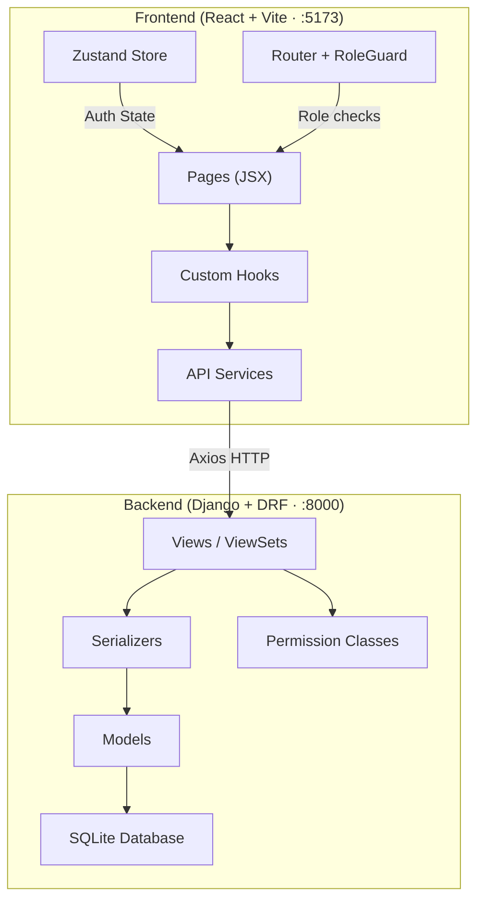
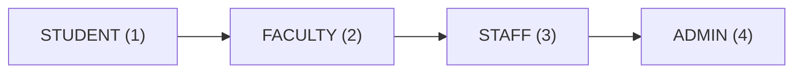
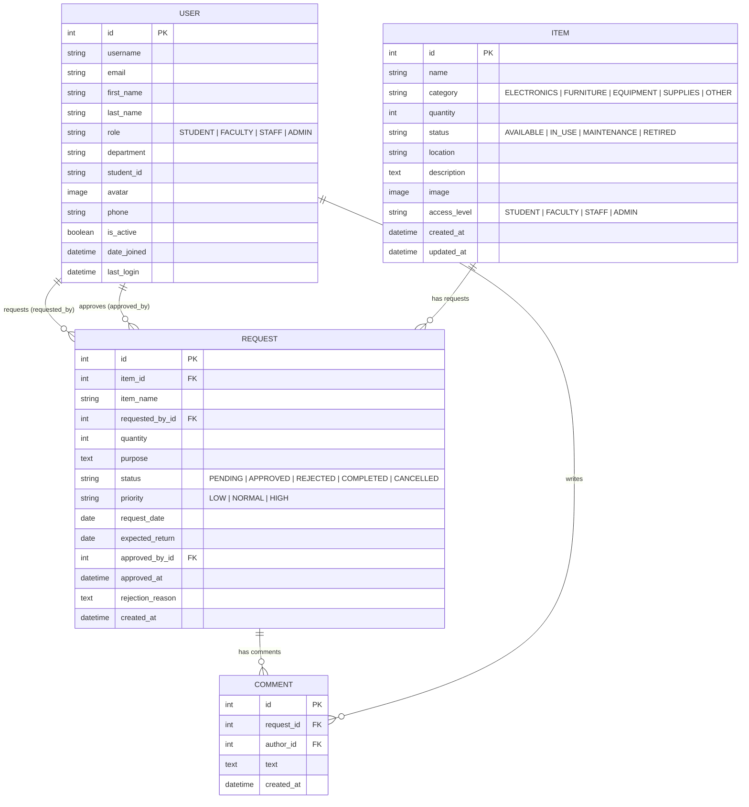
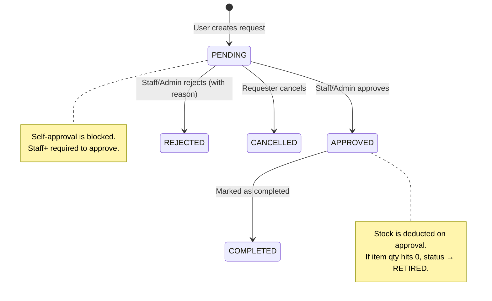
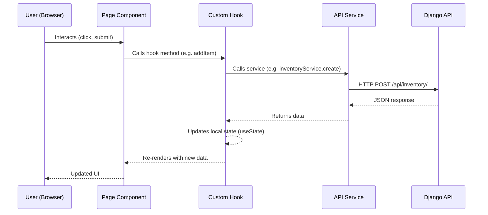
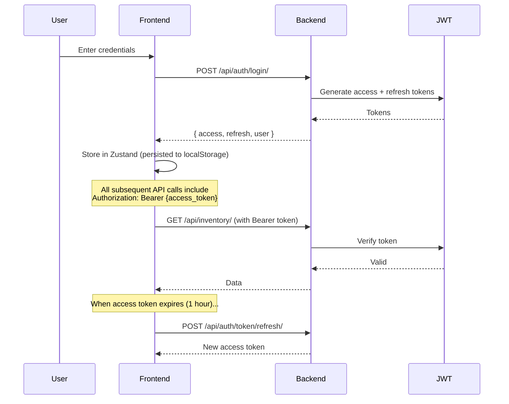

# PLMun Nexus — System Documentation

> **PLMun Inventory Nexus** is a full-stack web application for managing inventory items, handling borrow/request workflows, and administering users — all governed by a role-based access control system.

---

## 1. System Architecture



---

## 2. Tech Stack

| Layer | Technology |
|-------|-----------|
| Frontend | React 18, Vite 5, React Router v6, Zustand |
| Styling | Tailwind-like utility CSS, Lucide icons |
| HTTP Client | Axios (with JWT interceptors) |
| Backend | Django 6.0, Django REST Framework |
| Auth | JWT via `djangorestframework-simplejwt` |
| Database | SQLite (dev) |
| API Docs | drf-spectacular (Swagger + ReDoc) |

---

## 3. Role Hierarchy & Access Control



Each role **inherits all permissions of lower roles**. The `hasMinRole()` check means "this role level or higher."

### 3.1 Page Access Matrix

| Page | Student | Faculty | Staff | Admin |
|------|:-------:|:-------:|:-----:|:-----:|
| **Requests** | ✅ | ✅ | ✅ | ✅ |
| **Settings** | ✅ | ✅ | ✅ | ✅ |
| **Dashboard** | ❌ | ✅ | ✅ | ✅ |
| **Inventory** | ❌ | ✅ (view) | ✅ (edit) | ✅ (edit) |
| **Reports** | ❌ | ❌ | ✅ | ✅ |
| **Users** | ❌ | ❌ | ❌ | ✅ |

### 3.2 Settings Tab Visibility

| Tab | Student | Faculty | Staff | Admin |
|-----|:-------:|:-------:|:-----:|:-----:|
| Profile, Preferences, Security, Notifications, Appearance | ✅ | ✅ | ✅ | ✅ |
| Faculty Settings | ❌ | ✅ (exact) | ❌ | ❌ |
| Inventory Settings | ❌ | ❌ | ✅ | ✅ |
| System | ❌ | ❌ | ✅ | ✅ |
| User Management | ❌ | ❌ | ❌ | ✅ |
| Administration | ❌ | ❌ | ❌ | ✅ |

---

## 4. Data Models (Entity Relationship)



---

## 5. API Endpoints

### 5.1 Authentication (`/api/auth/`)

| Method | Endpoint | Description | Auth |
|--------|----------|-------------|------|
| POST | `/login/` | JWT login, returns tokens + user | Public |
| POST | `/register/` | Create account, auto-login | Public |
| POST | `/token/refresh/` | Refresh access token | Public |
| GET | `/profile/` | Get current user profile | Required |
| PUT | `/profile/` | Update profile fields | Required |
| POST | `/profile/password/` | Change password | Required |
| POST | `/profile/picture/` | Upload avatar image | Required |

### 5.2 Inventory (`/api/inventory/`)

| Method | Endpoint | Description | Min Role |
|--------|----------|-------------|----------|
| GET | `/` | List items (filtered by role) | Authenticated |
| POST | `/` | Create new item | Staff |
| GET | `/{id}/` | Get item details | Authenticated |
| PUT | `/{id}/` | Update item | Staff |
| DELETE | `/{id}/` | Delete item | Staff |
| GET | `/low_stock/` | Items with qty ≤ 5 | Authenticated |
| GET | `/out_of_stock/` | Items with qty = 0 | Authenticated |
| GET | `/stats/` | Inventory statistics | Authenticated |

> **Item access-level filtering**: Items have an `access_level` field. A Student can only see items with `access_level = STUDENT`. A Faculty user sees `STUDENT` + `FACULTY` items, etc.

### 5.3 Requests (`/api/requests/`)

| Method | Endpoint | Description | Min Role |
|--------|----------|-------------|----------|
| GET | `/` | List requests (own or all if Staff+) | Authenticated |
| POST | `/` | Create new request | Authenticated |
| GET | `/{id}/` | Get request details | Authenticated |
| POST | `/{id}/approve/` | Approve a pending request | Staff |
| POST | `/{id}/reject/` | Reject with reason | Staff |
| POST | `/{id}/complete/` | Mark approved → completed | Authenticated |
| POST | `/{id}/cancel/` | Cancel own pending request | Authenticated |
| GET | `/{id}/comments/` | List comments on request | Authenticated |
| POST | `/{id}/comments/` | Add comment | Authenticated |
| GET | `/stats/` | Request statistics | Authenticated |

### 5.4 Users (`/api/users/`)

| Method | Endpoint | Description | Min Role |
|--------|----------|-------------|----------|
| GET | `/` | List all users (search, filter) | Admin |
| GET | `/{id}/` | Get user detail | Admin |
| PUT | `/{id}/role/` | Change user role | Admin |
| POST | `/{id}/toggle_status/` | Activate/deactivate user | Admin |
| DELETE | `/{id}/` | Delete user | Admin |
| GET | `/stats/` | User count statistics | Admin |

---

## 6. Request Workflow (State Machine)



### Key Business Rules
- **Stock deduction**: Happens on approval — `item.quantity -= request.quantity`
- **Auto-retire**: If stock hits 0, the item status changes to `RETIRED`
- **No self-approval**: A user cannot approve their own request
- **Insufficient stock check**: Approval is rejected if stock < requested quantity
- **Cancel**: Only the requester (or Staff+) can cancel, and only if status is `PENDING`

---

## 7. Frontend Architecture

### 7.1 Project Structure

```
frontend/src/
├── pages/              # Full page components
│   ├── Login.jsx       # JWT login form
│   ├── Register.jsx    # Registration form
│   ├── Dashboard.jsx   # Stats overview (Faculty+)
│   ├── Inventory.jsx   # CRUD inventory items (Faculty+ view, Staff+ edit)
│   ├── Requests.jsx    # Request management (all roles)
│   ├── Reports.jsx     # Analytics & export (Staff+)
│   ├── Settings.jsx    # User preferences & admin config
│   └── Users.jsx       # User management (Admin only)
│
├── components/
│   ├── auth/           # RoleGuard, AuthModal
│   ├── layout/         # Sidebar, Header
│   ├── dashboard/      # Stats cards, charts
│   └── ui/             # Button, Card, Input, Modal, Table, etc.
│
├── hooks/              # Data-fetching hooks
│   ├── useInventory.js # Inventory CRUD + stats
│   ├── useRequests.js  # Request CRUD + workflow actions
│   └── useUsers.js     # User management CRUD
│
├── services/           # Axios API wrappers
│   ├── api.js          # Base Axios instance + JWT interceptors
│   ├── authService.js  # Auth endpoints
│   ├── inventoryService.js
│   ├── requestService.js
│   └── userService.js
│
├── store/
│   └── authStore.js    # Zustand: user, token, login/logout/profile
│
├── routes/
│   └── index.jsx       # Route definitions + ProtectedRoute + RoleGuard
│
└── utils/
    ├── roles.js        # ROLES, PERMISSIONS, hasMinRole, hasPermission
    └── exportUtils.js  # CSV/PDF export helpers
```

### 7.2 Data Flow



---

## 8. CRUD Operations Summary

### 8.1 Inventory Items

| Operation | Frontend | Backend | Who Can Do It |
|-----------|----------|---------|---------------|
| **List** | `useInventory.fetchInventory()` | `GET /api/inventory/` | All authenticated (filtered by role) |
| **Create** | `useInventory.addItem(data)` | `POST /api/inventory/` | Staff, Admin |
| **Read** | `inventoryService.getById(id)` | `GET /api/inventory/{id}/` | All authenticated |
| **Update** | `useInventory.updateItem(id, data)` | `PUT /api/inventory/{id}/` | Staff, Admin |
| **Delete** | `useInventory.deleteItem(id)` | `DELETE /api/inventory/{id}/` | Staff, Admin |

### 8.2 Requests

| Operation | Frontend | Backend | Who Can Do It |
|-----------|----------|---------|---------------|
| **List** | `useRequests.fetchRequests()` | `GET /api/requests/` | All (own only for Student/Faculty) |
| **Create** | `useRequests.createRequest(data)` | `POST /api/requests/` | All authenticated |
| **Approve** | `useRequests.approveRequest(id)` | `POST /api/requests/{id}/approve/` | Staff, Admin (not self) |
| **Reject** | `useRequests.rejectRequest(id, reason)` | `POST /api/requests/{id}/reject/` | Staff, Admin |
| **Complete** | `useRequests.completeRequest(id)` | `POST /api/requests/{id}/complete/` | All authenticated |
| **Cancel** | `useRequests.cancelRequest(id)` | `POST /api/requests/{id}/cancel/` | Owner or Staff+ |
| **Comment** | `useRequests.addComment(id, text)` | `POST /api/requests/{id}/comments/` | All authenticated |

### 8.3 Users (Admin Only)

| Operation | Frontend | Backend | Who Can Do It |
|-----------|----------|---------|---------------|
| **List** | `useUsers.fetchUsers()` | `GET /api/users/` | Admin |
| **Change Role** | `useUsers.updateUserRole(id, role)` | `PUT /api/users/{id}/role/` | Admin |
| **Toggle Active** | `useUsers.toggleUserStatus(id)` | `POST /api/users/{id}/toggle_status/` | Admin |
| **Delete** | `useUsers.deleteUser(id)` | `DELETE /api/users/{id}/` | Admin |

### 8.4 Profile (Self)

| Operation | Frontend | Backend | Who Can Do It |
|-----------|----------|---------|---------------|
| **View** | `authService.getProfile()` | `GET /api/auth/profile/` | Self |
| **Update** | `authStore.updateProfile(data)` | `PUT /api/auth/profile/` | Self |
| **Avatar** | `authStore.updateAvatar(file)` | `POST /api/auth/profile/picture/` | Self |
| **Password** | `authStore.changePassword(data)` | `POST /api/auth/profile/password/` | Self |

---

## 9. Authentication Flow



**Token Lifetimes:**
- Access token: **1 hour**
- Refresh token: **7 days**
- Refresh rotation enabled (new refresh token on each refresh)

---

## 10. Key Frontend Components

| Component | Purpose |
|-----------|---------|
| `RoleGuard` | Wraps routes/content, checks `minRole` before rendering |
| `FacultyOnly`, `StaffOnly`, `AdminOnly` | Convenience wrappers for role-restricted UI sections |
| `Sidebar` | Navigation sidebar with role-filtered menu items |
| `Modal` | Reusable modal dialog (used for delete confirm, forms) |
| `AnimatedBackground` | Visual effects behind the main content |
| `FAB` | Floating action button |
| `NotificationDropdown` | Header notification bell |
| `QRCodeModal` | Generate/display QR codes for inventory items |

---

## 11. Export Functionality

The system supports **CSV and PDF exports** for:
- **Inventory data** (from Inventory page)
- **Reports** (from Reports page)
- **User lists** (from Users page, Admin only)

Exports use `file-saver` and `jspdf` + `jspdf-autotable` libraries to generate downloadable files client-side.

---

## 12. Known Patterns & Conventions

| Pattern | Description |
|---------|-------------|
| **snake_case ↔ camelCase** | Backend uses `snake_case`, frontend uses `camelCase`. Serializers bridge this with fields like `dateAdded = DateTimeField(source='created_at')` |
| **Optimistic state updates** | Hooks update local state immediately after successful API calls rather than re-fetching |
| **JWT auto-refresh** | Axios interceptor catches 401 errors and automatically refreshes the token |
| **Role-based filtering** | Both backend (querysets) and frontend (RoleGuard/filters) enforce access control |
| **Zustand persistence** | Auth state (user, tokens) persisted to `localStorage` via Zustand `persist` middleware |
